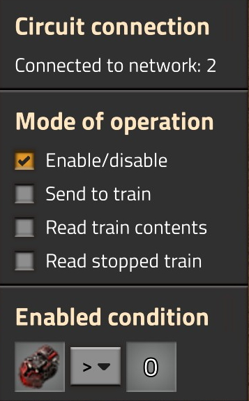
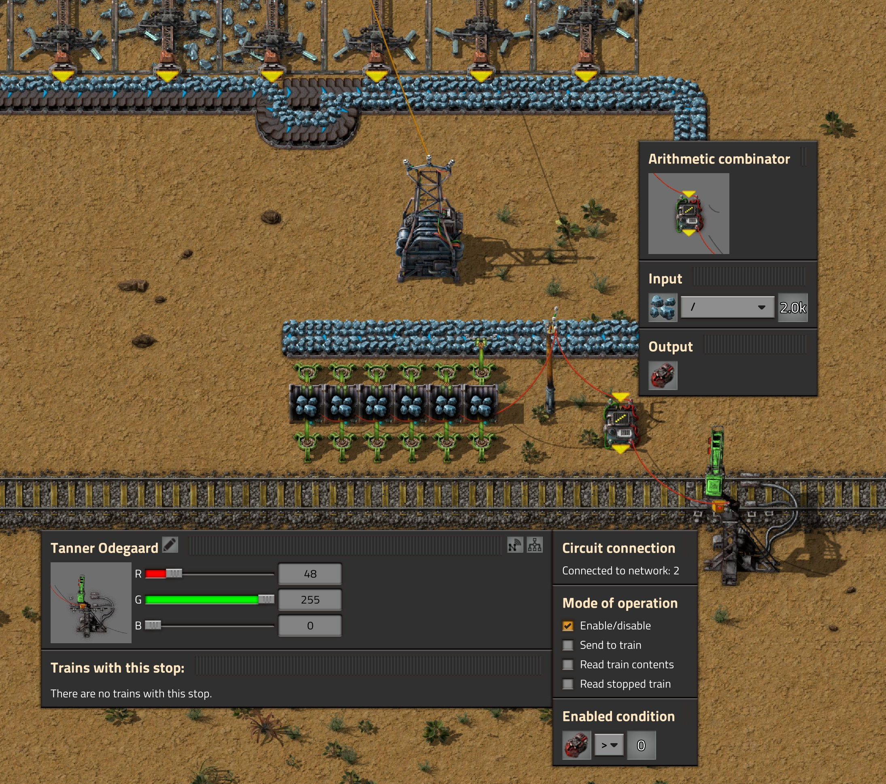
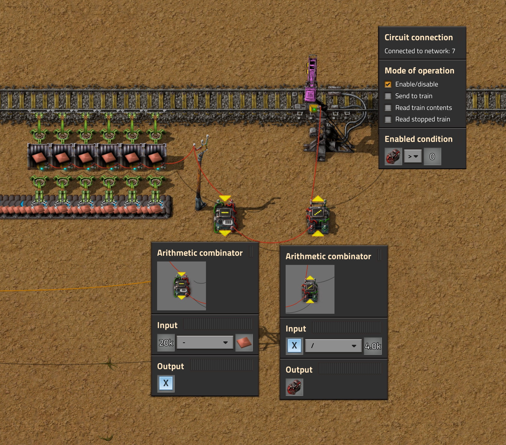

# Concurrent Train Restriction
## Factorio mod

Restrict amount of trains trying to reach station simultaneously by circuit network.

## Intro

In factorio train stop could be disabled by circuit network. 
But once it enabled again all trains scheduled to it will depart immediately.
Sometimes this is not desired behavior: e.g. producing (mining) station could have enough goods ready to fill single train only.

The mod allows to solve this issue by setting max trains quantity allowed to be sent to particular train stop.

## How to use:

- Connect train station to circuit network
- Set station behavior to Enable on condition  > 0
- Pass desired trains amount in  signal to station

On  station will output negated amount of trains heading here.

## Train stops

- Tick 'Enable/disable' mode of operation
- Set Enabled condition to  > 0 

## Producing station

- Connect buffer chests to Arithmetic combinator input
- Set Arithmetic combinator to divide input resources by train cargo capacity and output as 
- Connect Arithmetic combinator output to train station

## Consuming station

- Connect buffer chests to first Arithmetic combinator input
- Set first Arithmetic combinator to subtract input resources from desired resources amount
- Connect first Arithmetic combinator output to second Arithmetic combinator input
- Set second Arithmetic combinator to divide lacked resources by train cargo capacity and output as 
- Connect second Arithmetic combinator output to train station

## Improvements to consider

- Read train content and feed it back to combinators for more precise calculation
- Keep maximum allowed trains correspond to station stacker size (around two more combinators)

# Mod cons

This is more proof of concept mod and it have some significant drawbacks

- It creates invisible stops to keep trains move to location while actual station is disabled. Those stops will appear in trains schedule interface (with⇡ sign and number)
- Trains will not change destination if closer station with same name will become available
